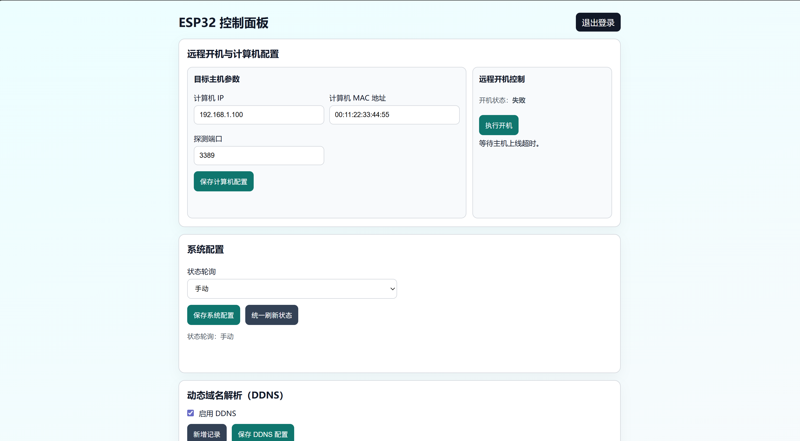
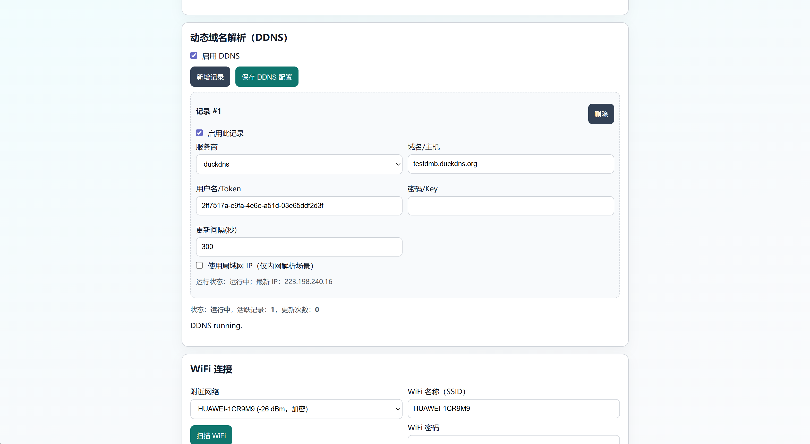

# ESP32App

## 产品效果图
### 页面1


### 页面2


基于 ESP32（Arduino + PlatformIO）的网页控制应用。

## 功能特性
- 登录认证（基于 Session Cookie）
- 登录后支持修改密码（明文持久化）
- WiFi 扫描与手动连接
- 仅支持远程开机（Wake-on-LAN）
- 计算机配置持久化管理：
  - 计算机名称
  - IP 地址
  - MAC 地址
  - 端口
  - 使用者
- 页面与交互提示中文化

## 技术栈
- ESP32（Arduino Framework）
- `ESPAsyncWebServer`
- `AsyncTCP`
- `Preferences`（NVS 持久化）

## 项目结构
- `src/`
  - `main.cpp`：启动与依赖组装
  - `AuthService.cpp`：认证、会话、密码修改逻辑
  - `WifiService.cpp`：WiFi 扫描与连接
  - `WakeOnLanService.cpp`：WOL 魔术包发送
  - `HostProbeService.cpp`：主机在线探测
  - `PowerOnService.cpp`：开机流程状态机编排
  - `ConfigStore.cpp`：配置持久化读写
  - `WebPortal.cpp`：HTTP 路由与页面渲染
- `include/`：模块头文件
- `test/`：单元测试代码
- `TESTING.md`：测试说明文档
- `需求文档.md`：原始需求文档

## 默认参数
- 配网 AP 名称：`ESP32-Setup`
- 配网 AP 密码：`12345678`
- 默认登录用户名：`admin`
- 默认登录密码：`admin123`

建议首次登录后在页面中立即修改密码。

## 编译

```powershell
C:\Users\25547\.platformio\penv\Scripts\platformio.exe run
```

## 烧录

```powershell
C:\Users\25547\.platformio\penv\Scripts\platformio.exe run -t upload
```

## 串口监视

```powershell
C:\Users\25547\.platformio\penv\Scripts\platformio.exe device monitor -b 115200
```

## 页面访问
1. 连接 ESP32 热点 `ESP32-Setup`
2. 浏览器打开 `http://192.168.4.1`
3. 登录后执行 WiFi、配置与远程开机操作

## 主要接口
- `GET /login`
- `POST /login`
- `GET /logout`
- `GET /api/config`
- `POST /api/config`
- `GET /api/wifi/scan`
- `POST /api/wifi/connect`
- `GET /api/power/status`
- `POST /api/power/on`
- `POST /api/auth/password`

## 测试
详细说明见 `TESTING.md`。

常用命令：

```powershell
# 仅构建测试（不上传、不执行）
C:\Users\25547\.platformio\penv\Scripts\platformio.exe test -e esp32dev_test --without-uploading --without-testing

# 在已连接 ESP32 上执行测试
C:\Users\25547\.platformio\penv\Scripts\platformio.exe test -e esp32dev_test
```

## 说明
- 登录会话为内存态并带有效期控制。
- 密码明文保存到 NVS（`Preferences`）。
- 计算机配置保存到 NVS（`Preferences`）。
- BUG:问题是不能检测到电脑是否开机，正在寻找解决方案。
